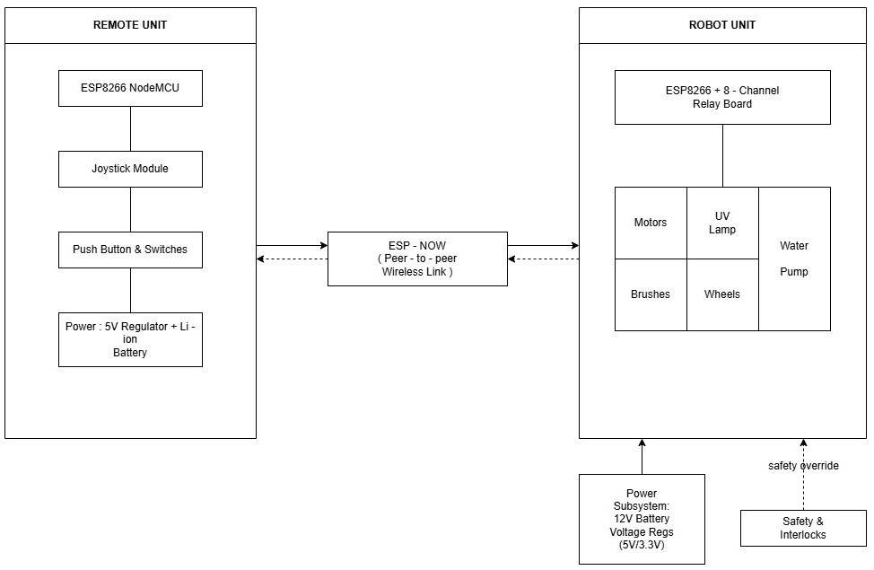
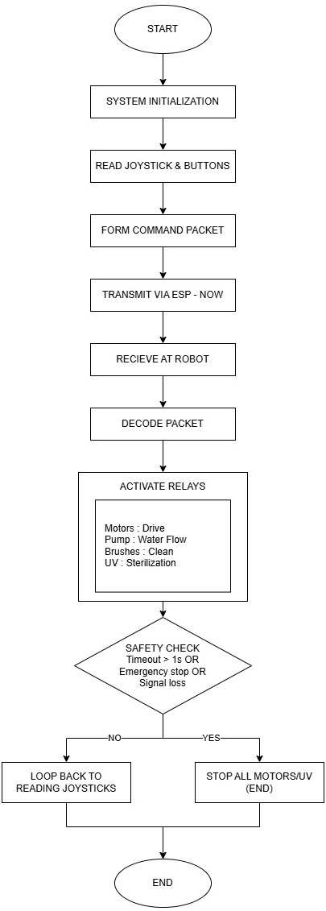
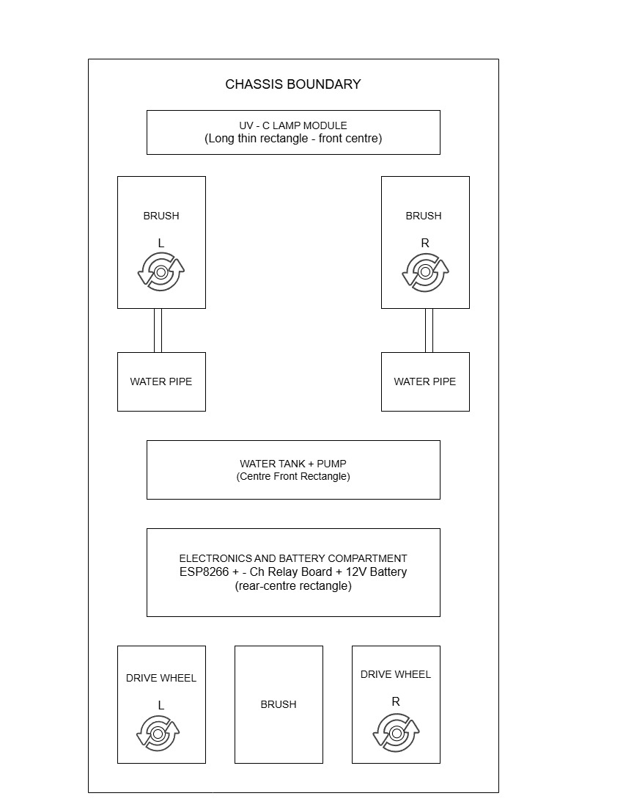
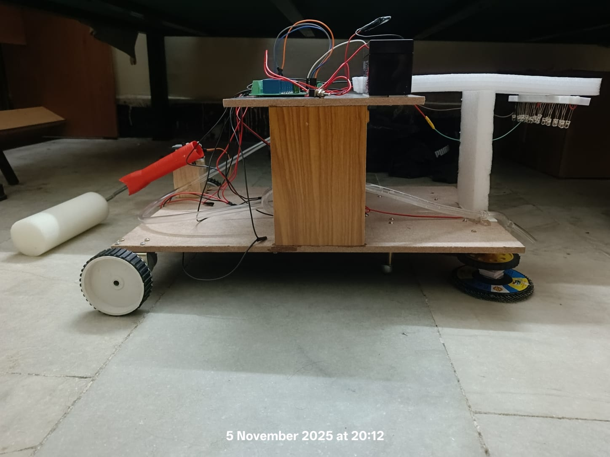
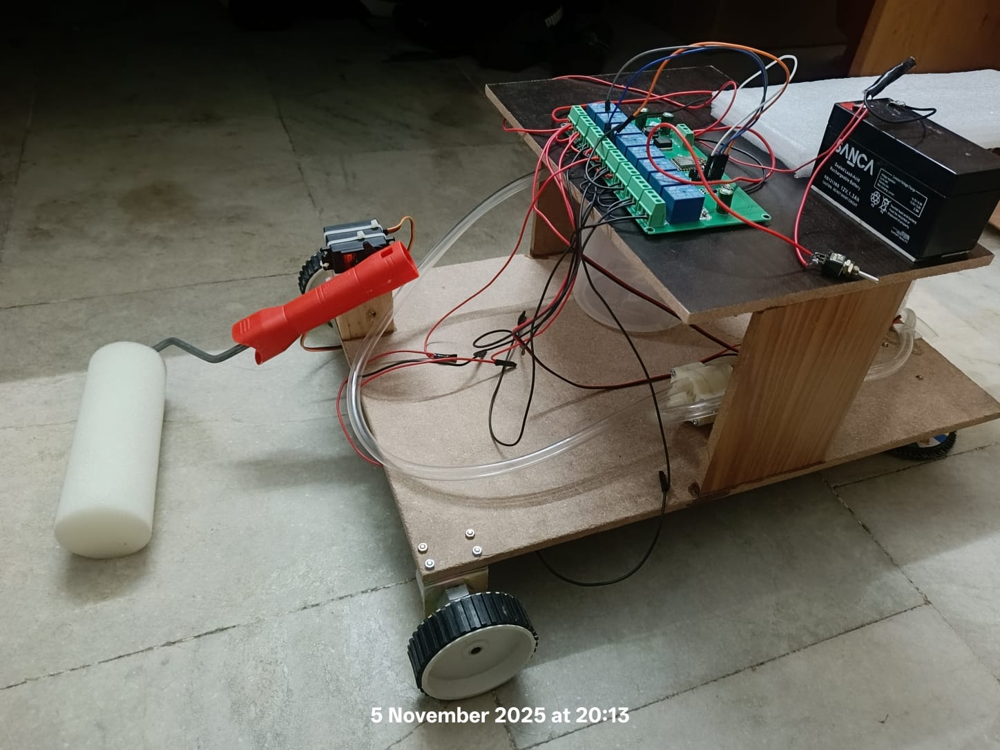
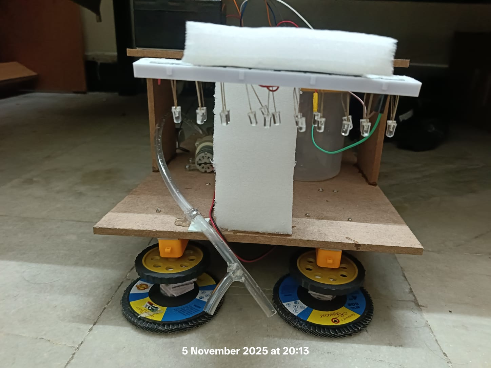
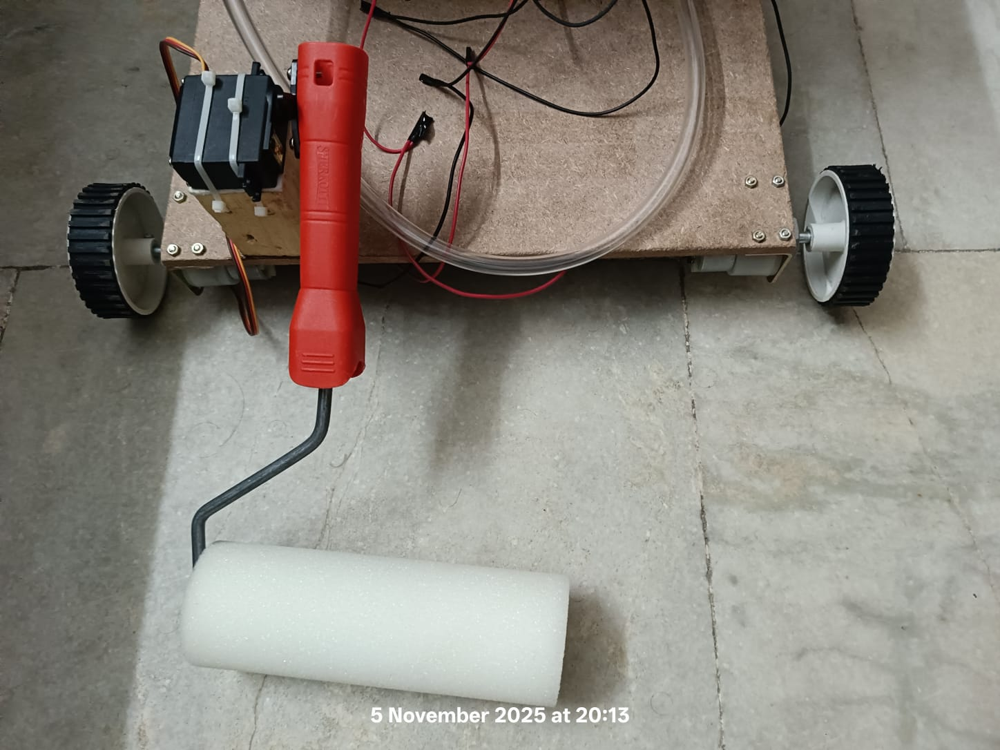

# Dual-Mode Hospital Sanitization Robot with UV-C Sterilization

> **ESP8266 + ESP32 | ESP-NOW Wireless | 8-Channel Relay | UV-C 254nm | Mechanical Cleaning + Sterilization**

---

## Overview

A remote-controlled hospital sanitization robot that combines two disinfection methods in one platform:

- **UV-C sterilization** (254nm lamp) — destroys bacterial DNA/RNA on surfaces without chemicals
- **Mechanical cleaning** — rotating brushes + water pump for physical dirt removal

The robot is operated wirelessly via a joystick remote using **ESP-NOW** — no WiFi router, no app, no internet required. Range ~30–50m indoors with latency under 5ms.

**Project context:** 21ECC301P — Microprocessor, Microcontroller and Interfacing Techniques | SRM Institute of Science and Technology, Batch 2027

---

## System Architecture



| Remote Unit (Transmitter) | Robot Unit (Receiver) |
|---|---|
| ESP32 DevKit (30-pin) | ESP8266 NodeMCU |
| Joystick (VRX/VRY) | L298N Motor Driver |
| 3x Push buttons (Pump/Brush/UV) | 8-Channel Relay Module |
| 5V Li-ion power | DC Drive Motors (x2) |
| ESP-NOW TX | Rotating Brushes (x3) |
| | Water Pump + Pipes |
| | 254nm UV-C Lamp (11W) |
| | 12V Li-ion Battery |

**Communication:** ESP-NOW peer-to-peer | Single-char command packets | No router needed

---

## Repository Structure

```
uvc-sanitization-robot/
│
├── robot_receiver/
│   └── robot_receiver.ino       ESP8266 receiver — relays, motors, UV control
│
├── remote_transmitter/
│   └── remote_transmitter.ino   ESP32 transmitter — joystick + button remote
│
├── docs/images/                 Block diagrams, flowchart, hardware photos
│
└── README.md
```

---

## Hardware

| Component | Specification | Role |
|---|---|---|
| Robot MCU | ESP8266 NodeMCU | Command reception, relay control |
| Remote MCU | ESP32 DevKit (30-pin) | Joystick reading, ESP-NOW TX |
| Motor Driver | L298N Dual H-Bridge | DC motor direction + speed |
| Relay Module | 8-channel, 5V active-LOW | UV lamp, pump, brush switching |
| UV-C Lamp | 254nm, 11W | Surface sterilization |
| Drive Motors | DC motors x2 | Differential drive chassis |
| Brush Assembly | 3x rotating brushes + DC motor | Mechanical floor cleaning |
| Water System | Mini DC pump + pipes | Wet cleaning / disinfectant spray |
| Battery (Robot) | 12V Li-ion | Main power |
| Battery (Remote) | 5V Li-ion | Remote power |
| Chassis | Two-tier wooden platform | Structural frame |

---

## Command Protocol

Single ASCII character sent via ESP-NOW:

| Command | Action |
|---|---|
| `F` | Move Forward |
| `B` | Move Backward |
| `L` | Turn Left |
| `R` | Turn Right |
| `S` | Stop all motors |
| `6` / `a` | Water Pump ON / OFF |
| `7` / `b` | Brush Motor ON / OFF |
| `8` / `c` | UV-C Lamp ON / OFF |

---

## Relay Pin Mapping (ESP8266 Receiver)

| Relay | GPIO | Function |
|---|---|---|
| RELAY1 | 16 | Motor Left Forward |
| RELAY2 | 14 | Motor Left Backward |
| RELAY3 | 12 | Motor Right Forward |
| RELAY4 | 13 | Motor Right Backward |
| RELAY5 | 15 | Motor Enable |
| RELAY6 | 0 | Water Pump |
| RELAY7 | 4 | Brush Motor |
| RELAY8 | 5 | UV-C Lamp |

---

## Safety Features

**UV interlock (software):**
- UV lamp (`8`) is blocked at the transmitter if the robot is moving
- UV lamp is automatically cut at the receiver if any motion command arrives while UV is ON
- Both transmitter and receiver enforce this independently — double safety

**Hardware interlocks:**
- Emergency stop button on remote
- UV-C lamp physically positioned to minimize operator exposure angle

---

## Control Flowchart



Flow: Joystick/button input → Form command packet → Transmit via ESP-NOW → Receive at robot → Decode command → Activate relay → Safety check → Loop

---

## Mechanical Design



- Two-tier wooden chassis — electronics on upper deck, drive system on lower deck
- Differential drive: 2x DC motors (rear), 2x caster wheels (front)
- 3x rotating nylon brushes — left, right, and centre floor contact
- UV-C lamp mounted on upper platform T-frame for surface coverage
- Water tank + pump in centre, pipes routed to brush assembly

---

## Hardware Photos






---

## Performance

| Metric | Value |
|---|---|
| Wireless Range | 30–50m (indoors, line-of-sight) |
| ESP-NOW Latency | <5ms |
| UV-C Coverage | ~20 sq.ft/min (theoretical, 11W lamp) |
| Battery Life | 2–3 hours continuous |
| Pathogen Reduction | 99.9% E. coli / MRSA (UV-C literature data) |
| Control Method | Physical joystick remote (reliable, low latency vs app) |

---

## Build Environment

| Component | Tool | Settings |
|---|---|---|
| Robot Receiver | Arduino IDE | Board: NodeMCU 1.0 (ESP-12E), 115200 baud |
| Remote Transmitter | Arduino IDE | Board: ESP32 Dev Module, 921600 baud |

**Libraries:** `ESP8266WiFi`, `espnow` (receiver) · `WiFi`, `esp_now` (transmitter)

**Note:** Update `receiverMac[]` in `remote_transmitter.ino` with your ESP8266's MAC address. Flash `robot_receiver.ino` first — MAC is printed on Serial Monitor at startup.

---

## Code Fixes Applied

The original code had the following issues that were corrected:

- `moveForward()` was activating all 5 relays identically to `moveBackward()` — motor direction relay logic fixed (RELAY1/RELAY2 for left motor, RELAY3/RELAY4 for right motor with correct polarity per direction)
- UV safety interlock added at receiver side (original only had it at transmitter)
- `esp_now_set_self_role(ESP_NOW_ROLE_SLAVE)` added to receiver (required for ESP8266 ESP-NOW)
- Duplicate transmitter code block in original Word file removed

---

## Team

Mohammed Ayaan · Mahesh Thombare · Khushi Jha
Course: 21ECC301P — SRM Institute of Science and Technology, Kattankulathur | Batch 2027
